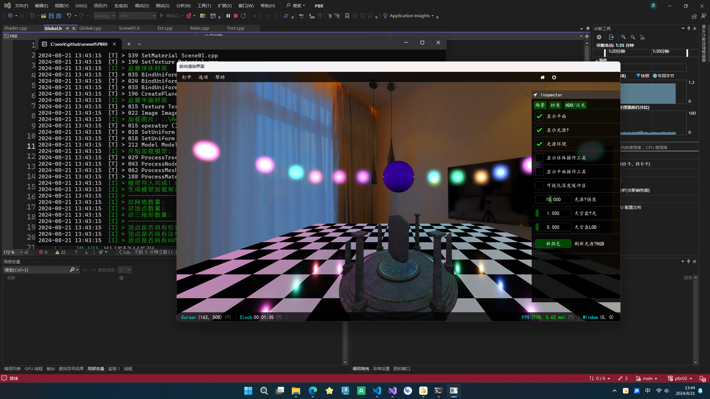
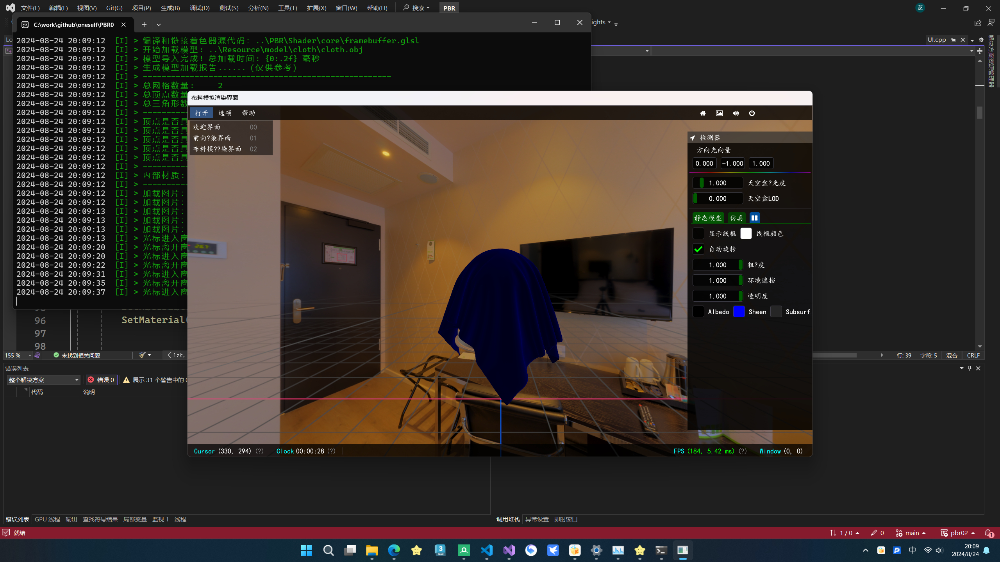
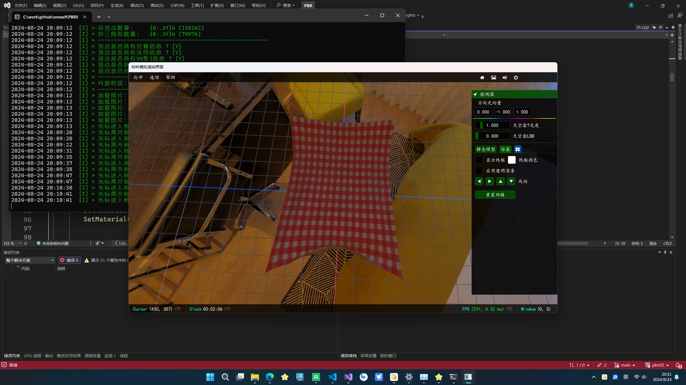
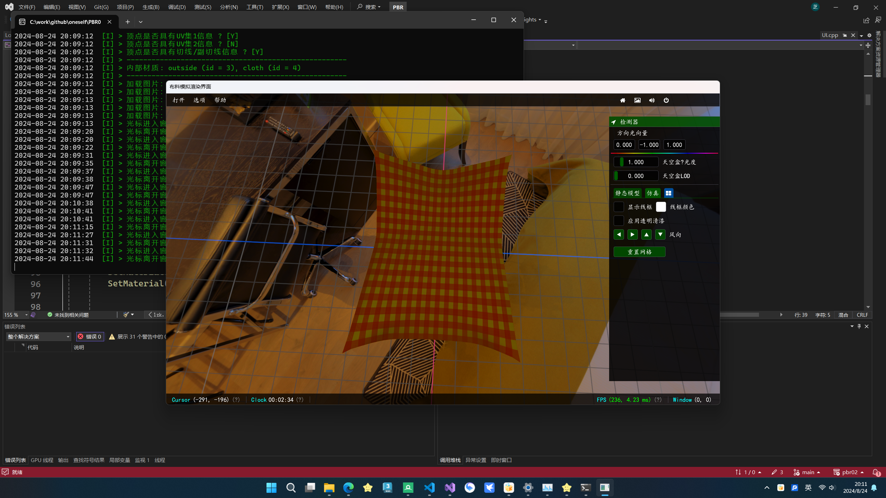

# pbr02 - 基于物理的小型渲染引擎

这是一个使用 OpenGL 4.6 和 C++17 构建的简单渲染库，目的是尝试各种渲染技术，并了解这些想法如何在光栅化管线中付诸实践。与主要基于数学和物理规则的离线路径追踪不同，由于实时渲染需要达到 60 FPS 的约束，实时渲染中充满了各种小技巧和妥协。此外，图形 API 背后还有许多底层细节，因此我们需要对渲染管线的每个步骤有深入的理解。

这个项目最初是为了学习现代 OpenGL 图形基础而启动的，后来引入了一些游戏引擎架构的想法，以扩大范围和抽象层次。它在设计时考虑了模块化，以便用户可以相对轻松地原型化新场景，因此我们可以更多地关注渲染算法，而不必过多担心细节。这也可以作为未来参考的有用框架和代码库，并且是实现更完整和高级功能的良好起点。

## 依赖项

- [GLFW](https://en.wikipedia.org/wiki/GLFW) (v3.3.2+) , [GLAD](https://glad.dav1d.de/), [GLM](https://glm.g-truc.net/0.9.2/api/index.html) (v0.9.2+)
- [Dear ImGui](https://github.com/ocornut/imgui) (GUI), [ImGuizmo](https://github.com/CedricGuillemet/ImGuizmo) (Gizmo 工具), [IconFontCppHeaders](https://github.com/juliettef/IconFontCppHeaders), [Optick](https://github.com/bombomby/optick) (性能分析工具), [taskflow](https://github.com/taskflow/taskflow) (并行任务系统)
- [EnTT](https://github.com/skypjack/entt) (实体组件系统), [Date](https://github.com/HowardHinnant/date) (时区处理), [stb](https://github.com/nothings/stb) (图像加载器),[Assimp](https://github.com/assimp/assimp)(3D模型文件加载库)

该项目目前还在进行中，后面会添加游戏引擎中的更多功能

## 目前实现的功能截图
前向渲染界面

布料仿真渲染界面

游戏引擎框架

